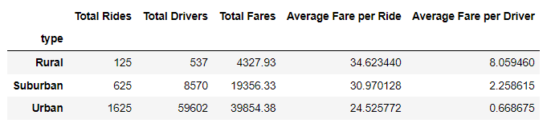
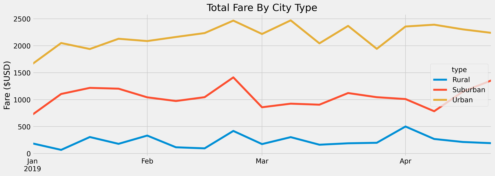

# PyBer_Analysis
## Overview
The purpose of the analysis is to show up how the data differs by city type and how those differences can be used by decision makers at PyBer. For this reason, it will create a summary DataFrame of the ride-sharing data by city type using python and pandas. On the other hand, the other graph to be created is a multiple-line graph that shows up the total weekly fares for each city type.
## Results
 
As we can see in the first dataframe, the urban cities has the highest numbers in total rides, total drivers, total fares, follow up by suburban cities and the rural cities. But the rural has the highest average fare per ride and average fare per driver. 
 
In the second chart that shows the total fare by city type in different months, we can see the urban cities has the highest total fares in all the months, close to march the urban cities reached up their highest number. The suburban cities were very close to 1000 dollars in total fares in all months. Finally, the rural cities had the lowest level of total fares in all months.  
## Summary
In the next lines, it will be suggested some recommendations for addressing any disparities among the city types.
There is an opportuniy to offer ride-sharing services in suburban cities that could be more conveniant.
Although, the number of rides and total drivers is low in rural cities, it could be potentially a great service to take in consideration for this underserved communities that has a high average fare per ride and driver.
The suburban cities could use the ride-sharing service than traditional because there is more variety of people with similar preferences to the ride-sharing service.
